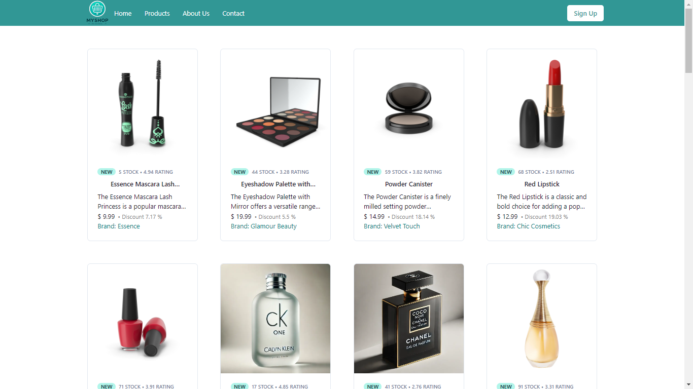
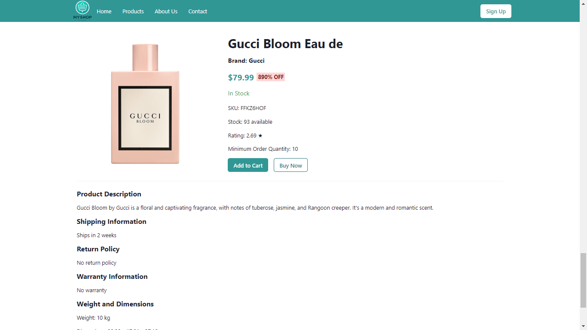

# E-Commerce Website

## Project Overview

This project is an e-commerce website currently under development. It provides a basic structure with essential components, designed for a responsive and interactive user experience.

### Technologies Used

- **Frontend:** React, Vite
- **Styling:** Chakra UI
- **Backend:** Firebase
- **HTTP Requests:** Axios

### Features Implemented

- **Navbar:** Basic navigation bar for site navigation.
- **Product Cards:** Displays products in a card format.
- **Footer:** Includes essential site information and links.
- **Single Product UI:** Page for viewing product details.

### Project Status

This project is still under development. Current features are functional, but further enhancements and features are planned.


### Preview







## Getting Started

To contribute to or modify this project, please fork the repository and clone your fork to your local machine.

### Forking and Cloning

1. **Fork the Repository:**
   - Click the "Fork" button at the top right of this repository page to create a copy under your GitHub account.

2. **Clone Your Fork:**

   ```bash
   git clone https://github.com/AdeebaNaushad/E-commerce-website-.git

3. **Navigate to the Project Directory:**
   ```bash
   cd E-commerce-website-

4. **Install Dependencies:**
   ```bash
   npm install
5. **Start the Development Server:**
    ```bash
   npm run dev
The application will be available at <code>http://localhost:5173</code>.   


   
